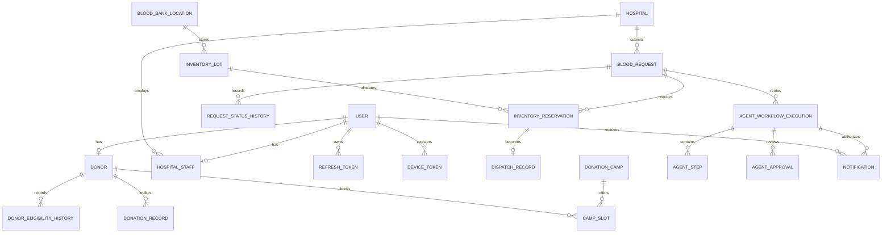

# LifeLink Entity-Relationship Diagram

This reviewed model is the source of truth for the initial EF Core migration. Audit timestamps, JSON payload columns, indexes, and check constraints remain authoritative in `LifeLinkDbContext`.

## Important invariants

- Emails, hospital registration numbers, device tokens, reservation idempotency keys, notification idempotency keys, and workflow correlation IDs are unique.
- A user has at most one donor or hospital-staff profile.
- Inventory is lot-based and reservations are independently auditable, expiring, and concurrency-protected.
- A request can trigger multiple workflow attempts; `(request_id, attempt_number)` is unique.
- Agent plan/input/output/tool data is structured JSONB. Raw chain-of-thought and credentials are never stored.
- Audit-linked records use restricted deletes. Synthetic data only is permitted for development and demonstrations.
